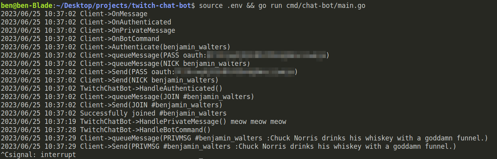

# twitch-chat-bot

Create an automated [Twitch](https://dev.twitch.tv/docs/irc) chat bot console application that can be run from a command line interface (CLI).

## Requirements
---
The bot application should be able to:
* Console output all interactions - legibly formatted, with timestamps.
* Connect to Twitch IRC over SSL.
* Avoid premature disconnections by handling Twitch courier ping / pong requests.
* Join a channel.
* Read a channel.
* Write to a channel - specifically, reply to the "!chucknorris" command by dynamically returning a random fact about Chuck Norris using the [Chuck Norris API](https://api.chucknorris.io).

## Caveats ##
---
* If at all possible, the application should be written without third-party module dependencies in Golang.
* All interactions should be asynchronous.
* The application should account for Twitch API rate limits.
* The application should not exit prematurely.

## Functionality
- define a command (message) to listen for from twitch chat
- provide authentication mechanism w/twitch so we can read messages on the chat window
- reach out to 3rd party API and then post some data back to the calling user
- should appear in the chat window

# Command Output



## Running

- `cp .env.example .env`
- update `.env` with appropriate values
- execute `source .env && go run cmd/chat-bot/main.go`

## Testing

I dropped a few basic tests to ensure message parsing was working as expected. Would liked to have gotten further :(

```
$ go test pkg/irc/*.go
```